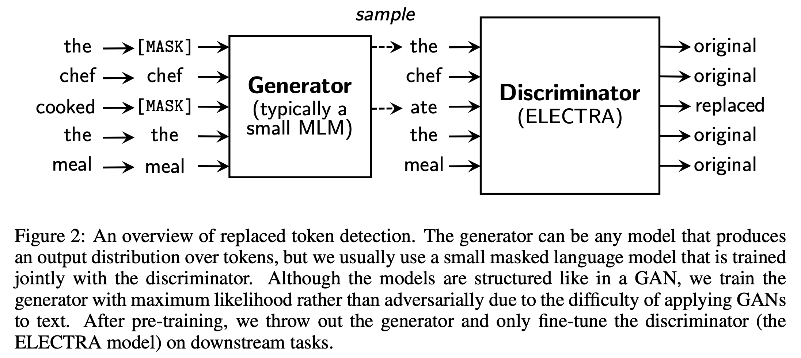
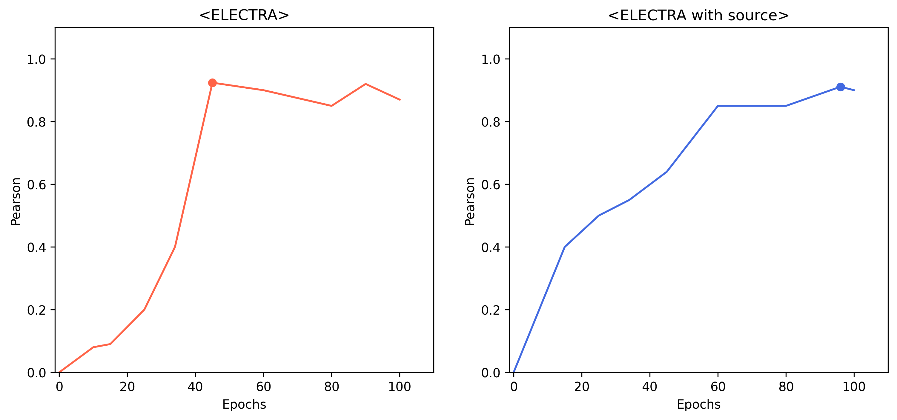
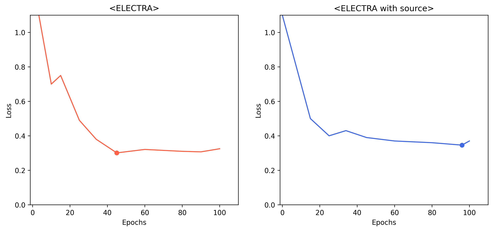

# KoELECTRA

<center></center>

- `Replaced Token Detection`을 기반으로 사전학습 된 모델
- __34GB의__ 한국어로 학습

<br>

# Tokenizer

- __Wordpiece__

- vocab size : 35000

<br>

# Data

비공개 데이터 사용  

## features
- sentence 1 : 문장1
- sentence 2 : 문장2
- source : 문장 출처
- label : 0-5 사이의 값 (클수록 유사도가 높음)

## The number of data
- train data : 9324개
- valid data : 550개
- test data : 1100개

<br>

# 학습

- 최초 학습

```
python3 main.py --config <config name>
```

- 이어서 학습

```
python3 main.py --checkpoint <checkpoint name> --add_epochs <epochs> --add_lr <lr>
```

학습률을 변경하고 싶을때는 `add_lr`인자를 사용하며 인자를 주지 않을시 기존 learning rate를 유지한다.

<br>

# 실험

1. 데이터 증강 (switch)  
 STS task는 방향성이 존재하지 않으므로 문장의 앞뒤 순서를 바꿔주는 기법으로 데이터 증강 시도  
 *pearson 0.8725 -> 0.8896*

2. Feature embedding  
데이터의 *source*피처를 학습에 사용하기 위한 시도  
출처에 따라 0과 1로 변환 후 embedding layer를 통해 차원변환 후 *CLS*토큰과 더해주는 실험  
*pearson 0.8713 -> 0.7788*

<br>


# Results

## Pearson Correlation Coefficient
<center></center>
<br>

## Loss
<center></center>

<br>

# Conclusion

KoELECTRA 자체보다 source피처를 임베딩하여 사용한 KoELECTRA이 학습에 도움을 줄 것이라 예상했지만 그렇지 않았다.  
모델이 너무 단순하여 학습을 제대로 못했을지 모르며 오히려 모델에게 혼란성을 부여했을수도 있다.  
최종적으로 선택한 모델은 KoELECTRA였고 리더보드에서도 꽤 좋은 점수를 받았다. 하지만 private 리더보드에서는 다소 점수가 떨어지는 현상이 일어났으며 오히려 source피처를 사용한 모델이 더 높은 점수를 받았다. 이처럼 여러가지 피처들을 적절히 사용한다면 일반화 능력이 올라갈수 있다는 가능성을 보았다.